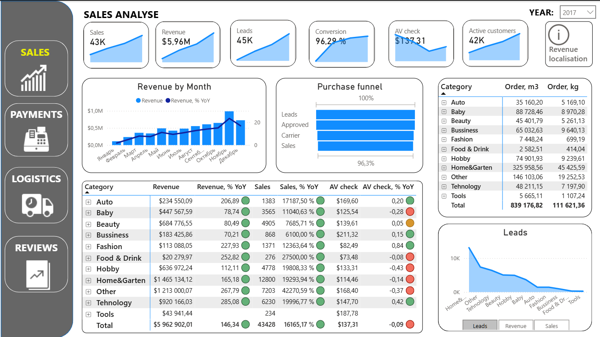
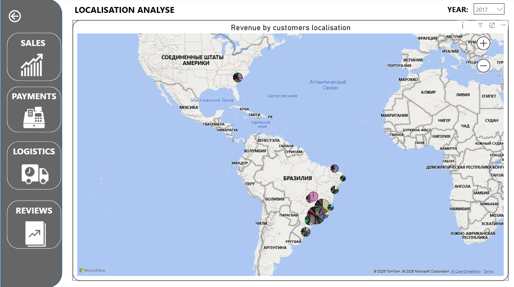
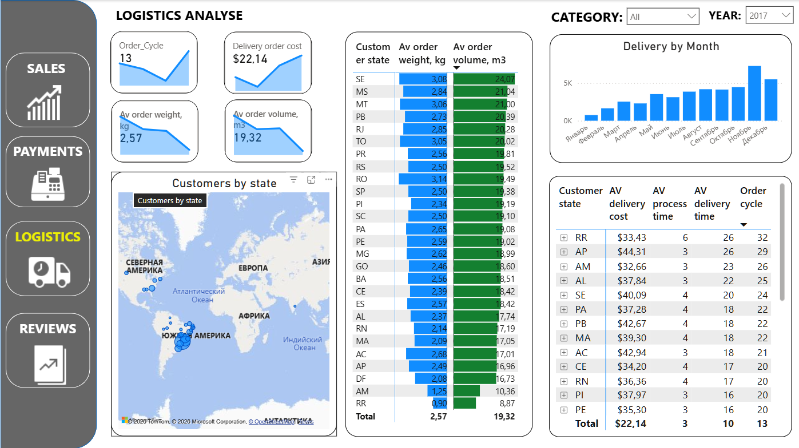
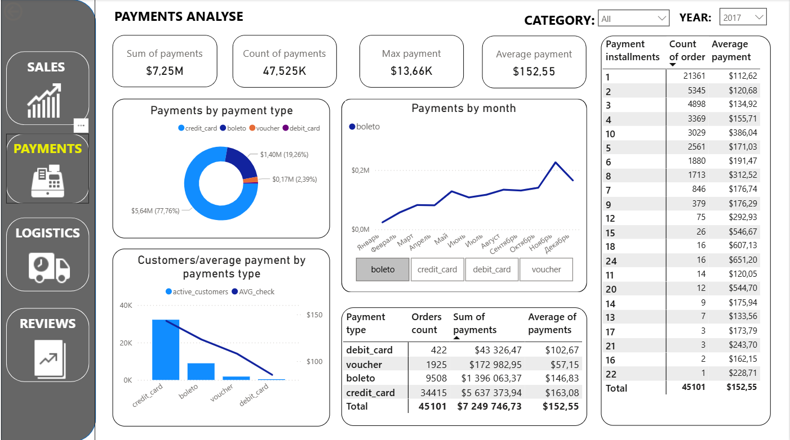
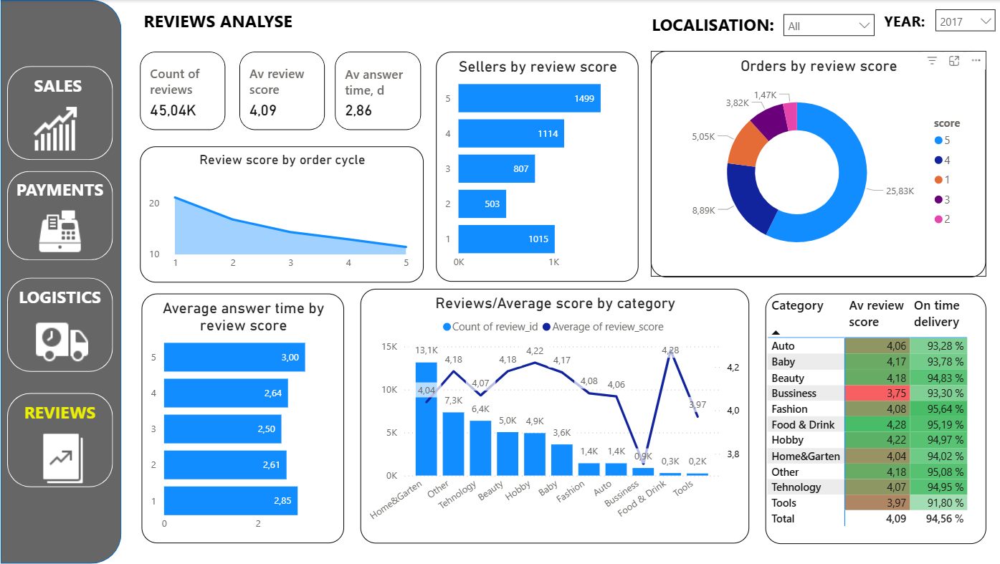

# Power BI Dashboard

## 🛍️ E-Commerce Operations Dashboard

A 6-page operational analytics dashboard covering a full e-commerce order lifecycle — from sales performance to logistics, payments, and customer reviews — built on a Brazilian e-commerce marketplace dataset.

📥 **[Download the .pbix](ecommerce-operations-dashboard.pbix)** — requires [Power BI Desktop](https://www.microsoft.com/en-us/power-platform/products/power-bi/desktop) (free) to open. Screenshots below cover every page.

### Sales

Revenue, leads, conversion rate, and average check, with a purchase funnel (Leads → Approved → Carrier → Sales) and a category-level revenue/sales breakdown with year-over-year change.

### Sales Localisation

Revenue by customer location on a map, letting you spot geographic concentration of sales at a glance.

### Logistics

Order cycle time, delivery cost, and average order weight/volume, broken down by customer state, plus delivery volume by month.

### Payments

Payment volume and average payment by method (credit card, boleto, voucher, debit card), and a breakdown by number of installments.

### Reviews

Review score distribution, average response time, and on-time delivery rate by product category — useful for spotting which categories drive down customer satisfaction.

## 📌 Notes

- File is tracked via **Git LFS** (~38 MB) — see the repository root README for setup if cloning.
