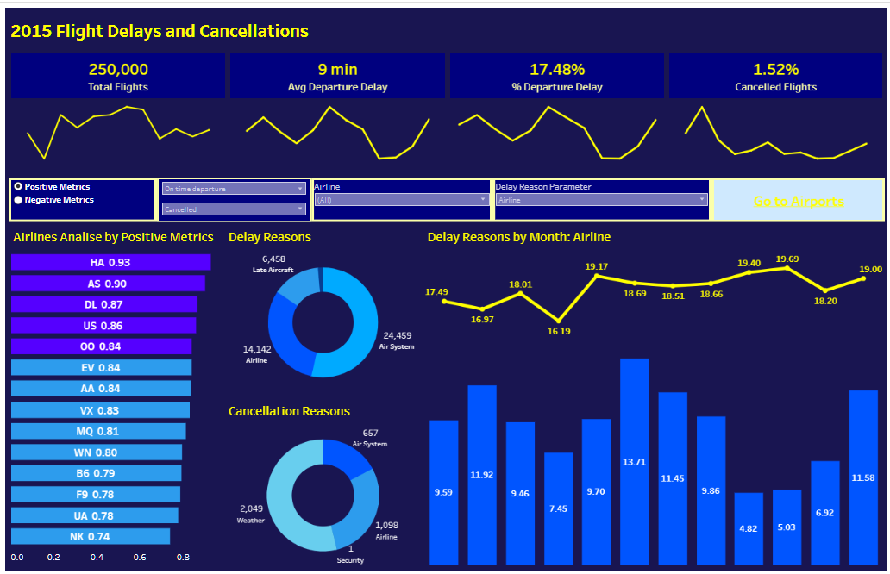
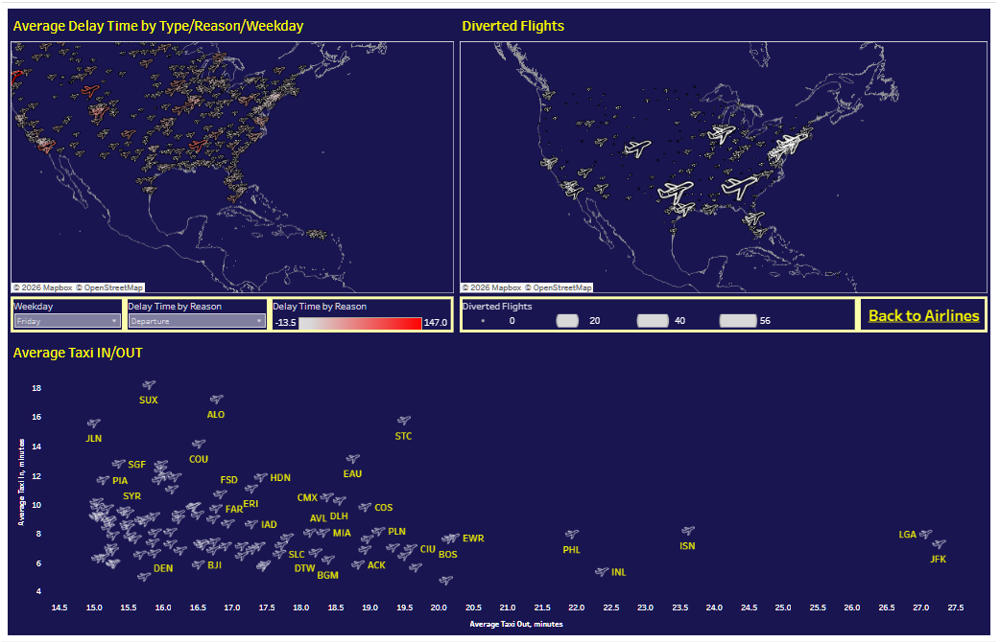
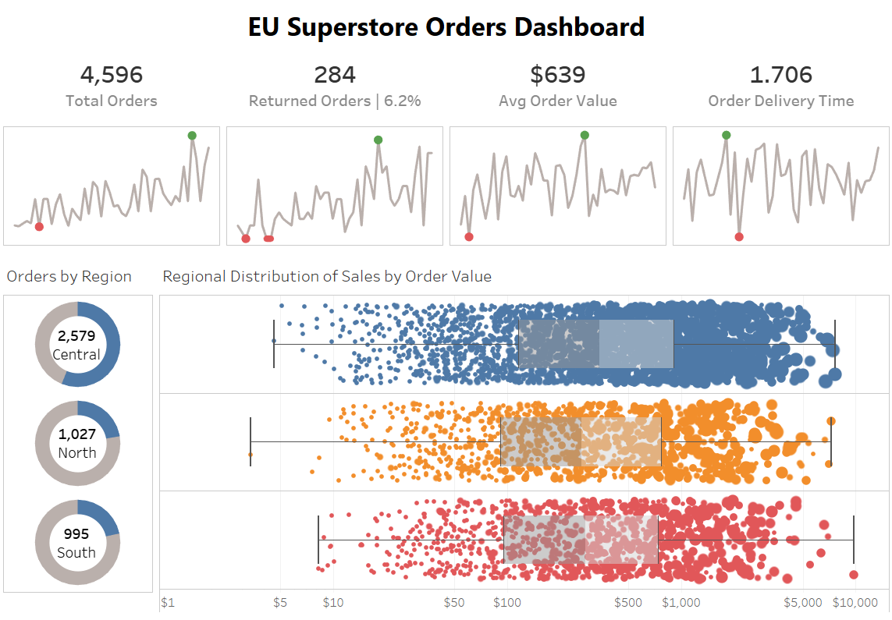

# Tableau Dashboards

Two interactive dashboards, published live on Tableau Public — no download or software required to explore them.

## ✈️ Flight Delays and Cancellations

**[Open live on Tableau Public →](https://public.tableau.com/app/profile/yehra/viz/flight-delays-analysis/Airlines)**

A two-page analysis of U.S. domestic flight delays and cancellations, covering both airline performance and airport/route-level detail.

**Airlines page** — top-level KPIs (total flights, average departure delay, % delayed, % cancelled), an airline ranking by a composite positive-performance score, delay/cancellation reason breakdowns, and delay trends by month.

**Airports page** — a geographic view of average delay time by weekday and reason, a map of diverted flights, and a scatter plot comparing average taxi-in vs. taxi-out time by airport — useful for spotting airports with structurally slow ground operations rather than just weather-driven delays.

## 🛒 EU Superstore Orders Dashboard

**[Open live on Tableau Public →](https://public.tableau.com/app/profile/yehra/viz/eu-superstore-orders-dashboard/EUSuperstoreOrdersDashboard)**

A compact operational dashboard for a retail order dataset: total orders, return rate, average order value, and delivery time, broken down by region.

Includes a regional order-value distribution view (jittered strip plot with box-plot overlay) comparing Central, North, and South regions side by side — useful for spotting differences in order-value spread, not just averages.

## 📌 Notes

Both workbooks were originally created as part of coursework; the datasets are standard practice datasets (US flight performance data, EU Superstore retail data), not proprietary or client data.
